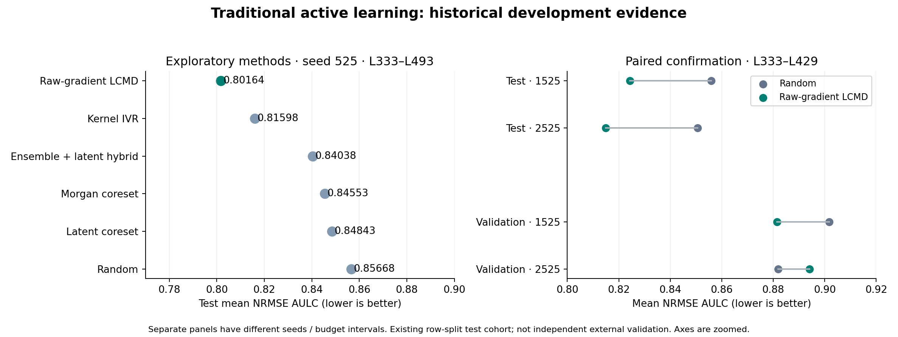
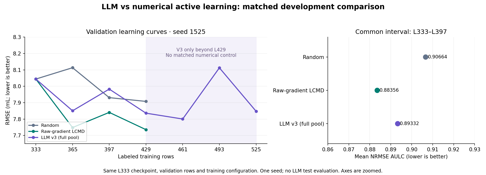

# ODH 复现与主动学习结果汇总（2026-10-05）

## 当前进度

全量 LLM V3 已完成六轮：L333 → L525，共新增 192 条训练标签。日志完成时间为北京时间 2026-10-03 03:02；当前没有该流程的运行进程。已重新核验六轮 complete.json 所绑定的训练、指标及选择文件哈希，并核对相同训练设置及验证集行号。

最终验证 RMSE **7.8475**、MAE **5.1074**、R² **0.2040**。相对 L333 的 RMSE 降低 **2.44%**。轨迹最低 RMSE 为 L461 的 **7.8004**；这是回顾性最佳点，不替代预定 L525 终点。LLM 流程未读取测试标签。

| 轮次 | 标注数 | 全量候选数 | 验证 RMSE | 验证 MAE | 验证 R² |
| --- | --- | --- | --- | --- | --- |
| 1 | 365 | 4114 | 7.8506 | 4.9993 | 0.2034 |
| 2 | 397 | 4082 | 7.9828 | 5.2036 | 0.1763 |
| 3 | 429 | 4050 | 7.8360 | 5.0529 | 0.2063 |
| 4 | 461 | 4018 | 7.8004 | 4.8444 | 0.2135 |
| 5 | 493 | 3986 | 8.1125 | 5.3438 | 0.1493 |
| 6 | 525 | 3954 | 7.8475 | 5.1074 | 0.2040 |

## 原模型复现

完整运行官方兼容训练 1,500 epochs，4,447 条训练样本，验证/测试各 247 条，使用最后 epoch 模型。论文数据重算与复现分别为：

| 测试指标 | 论文源数据重算 | 本项目正式复现 |
| --- | ---: | ---: |
| RMSE | 3.9173 | 4.1774 |
| MAE | 2.7435 | 2.6787 |
| R² | 0.7778 | 0.7474 |

正式复现使用全训练集、不同训练时长及划分设定，不能与 L333–L525 的主动学习验证误差直接排名。随机行划分存在分子交叠，属于论文协议兼容性复现，不代表对新分子的独立泛化。q10–q90 区间覆盖率仅 18.62%，不能把区间宽度当作已校准不确定性。

来源：../../../docs/research/ODH_BASELINE_REPRODUCTION.md。

## 传统主动学习

已完成 Random、raw/unit-gradient LCMD、raw/unit-gradient MaxDet、latent/Morgan coreset、kernel IVR、ensemble+latent hybrid 等探索。训练诊断另有固定 L0 的九次训练，不是九条 AL 轨迹。更改梯度归一化会显著改变选样，但现有结果不能证明归一化提高标签效率。

raw/unit-gradient 的早期配对探索均为 seed 525、L333–L429，历史测试集平均 NRMSE：

| 方法 | 测试 NRMSE AULC |
| --- | --- |
| raw_gradient_lcmd | 0.81964 |
| random | 0.83713 |
| raw_gradient_maxdet | 0.84382 |
| unit_gradient_maxdet | 0.84837 |
| unit_gradient_lcmd | 0.85875 |

当前较有支持的传统比较基线是 **raw-gradient LCMD**。seed 525 的 L333–L493 历史测试集曲线均值如下（越低越好；重复使用的 Random/LCMD 数据只计一次）：

| 方法 | 测试 NRMSE AULC | L493 测试 RMSE |
| --- | --- | --- |
| Raw-gradient LCMD | 0.80164 | 6.8955 |
| Kernel IVR | 0.81598 | 7.0393 |
| Ensemble + latent hybrid | 0.84038 | 7.1382 |
| Morgan coreset | 0.84553 | 7.5376 |
| Latent coreset | 0.84843 | 7.5839 |
| Random | 0.85668 | 7.5978 |

两种新增初始化种子 1525/2525 的配对确认只运行至 L429，LCMD 测试 AULC 比 Random 分别降低 **3.70% / 4.20%**；但验证集方向不一致（1525 有利于 LCMD，2525 有利于 Random）。不能据此声称普遍显著优越；所有结果仍来自同一个历史 Row cohort。

## LLM 主动学习尝试

| 版本 | 完成情况 | 可解释的证据 |
| --- | --- | --- |
| Global v3 | seed 1525，6 轮到 L525 | gpt-6-astra / Responses；每轮全部候选在一次请求中提交，统一选 32 条 |

V3 的分页只负责承载数据，无分块预筛选。按用户要求，单字段解释文字长度已由硬限制改为建议。另有历史假设更新缺失导致的一次第三轮回复拒收，重试后的完整回复通过校验；没有自动补写模型证据。每日额度阻塞造成的中断也保留了记录。

旧 partial-visibility、分块未完成和历史 hybrid 实验已按用户要求从当前版本移除，不进入本报告的性能比较。仅保留完整 V3 校验所必需的原始基线依赖文件。

## 传统与 LLM 的直接对比

下面使用 seed 1525、同一 L333 模型、相同训练设置与验证集。AULC 为预算区间内 NRMSE 的梯形积分除以区间长度，分母为固定 L333 目标标准差 8.879240547556758；数值越低越好。

共同区间 **L333–L397**（三种方法均有结果）：

| 方法 | 验证 NRMSE AULC |
| --- | --- |
| Random | 0.90664 |
| Raw-gradient LCMD | 0.88356 |
| LLM v3 (full pool) | 0.89332 |

共同区间 **L333–L429**（三种方法均有结果）：

| 方法 | 验证 NRMSE AULC |
| --- | --- |
| Random | 0.90172 |
| Raw-gradient LCMD | 0.88141 |
| LLM v3 (full pool) | 0.89247 |

V3 在共同区间内的曲线均值优于 Random，但仍落后于 raw-gradient LCMD；这只是单种子开发集比较。L397 的单点上 V3 还略差于 Random，不能声称每轮都更好。V3 的 L461–L525 没有同种子、同预算的 Random/LCMD 对照，图中没有延长传统曲线或借用 seed 525 来拼接。V3 全区间 L333–L525 的均值 NRMSE 为 **0.89212**，不能与短区间的 AULC 直接排名。

## 下一步最有价值的比较

若继续评估收益，应先补齐 seed 1525 的 Random/LCMD 至 L525，并增加配对种子；最终确认应使用未用于开发的新划分或独立实验队列。当前汇总没有新增训练、调用 LLM 或打开新的测试标签。

## 文件与复核

- `comparison_data.json`：汇总指标和六轮数据。
- `matched_validation_metrics.csv`：主图的逐点数值。
- `llm_vs_traditional.png/.pdf`、`traditional_methods.png/.pdf`：可分享图片与矢量图。
- `source_manifest.json`：输入文件 SHA256。
- `build_report.py`：从已有指标重建本报告与图，运行环境为项目 `.conda-hplc-al`。
