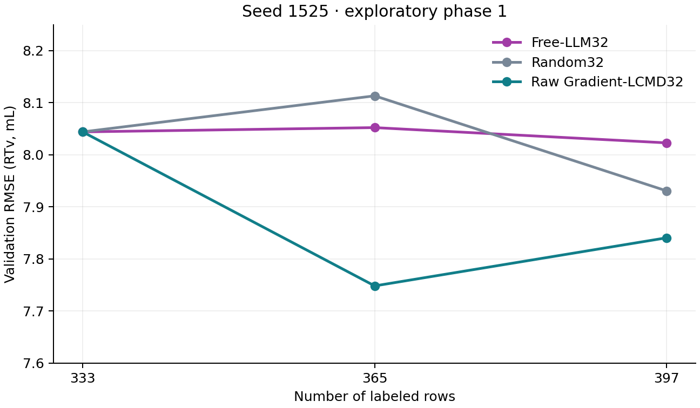

# Free-LLM32：seed 1525，L333 → L397 中期报告

已完成两次 acquisition 和两次 scratch retrain，停止于 **L397**。未启动第三轮、第二 seed、hybrid 或 masked；未解析 test truth。最终审计见 `transport_revision_2/final_audit.json`。

**判断：预测样本效率接近 Random，仍落后 LCMD；有清楚的反馈驱动科学规划信号，但尚无证据表明这些规划带来了更好的整体预测收益。** L397 RMSE 为 8.0229，较 Random 高 1.16%、较 LCMD 高 2.32%；区间平均 NRMSE AULC 较 Random 低 0.092%、较 LCMD 高 2.52%。这些是单 seed 的探索结果，不作显著性或化学知识因果增益主张。

## 一、实现与可审计边界

新策略 `free_llm32_scientist` 对完整合法 U 独立选择32点，pending=0，没有 LCMD 预留名额。旧16+16实现保留，仅修正共用预算常量/参数契约；全部566个旧 LLM、LCMD confirmation、IVR artifact 的哈希和文件集合保持不变。原审计见 `AUDIT.md`。

LLM可见 canonical isomeric SMILES、CIP/立体中心、Murcko scaffold、官能团、MW/LogP/TPSA/HBD/HBA/可旋转键/芳环、IPA比例、flow，以及当前 QGeoGNN q10、center、q90、q90−q10、512维全网络梯度 CountSketch 中最近已标记点距离的百分位。center是MSE训练输出，不声称是q50；quantile width不是校准的epistemic uncertainty，coverage不是真误差。没有coverage最大化要求或任何化学/探索配额。

科学记忆由代码确定性拼接：本 seed/method 的最近三批原始记录（本次最多只有前一批）、前次理由与假设、每个已获取实验的结构/条件/测量前冻结预测/实测RTv/signed_error/abs_error、16条高误差观测、假设状态及未决问题。signed_error始终等于测量前center−实测RTv。Round1明确获得Round0全部32条反馈和8个旧假设。没有摘要LLM、跨seed或跨method记忆。

每轮使用round-salted稳定哈希初始展示；默认查询排序也采用该哈希。完整查询页实际发送给LLM，返回total_matches与next_offset。候选卡严格不含标签；只有已测observed记录可带response和冻结误差。

| 冻结项目 | 值 |
|---|---|
| Model / effort | gpt-6-sol / high |
| Query / candidate view / call / page | 24 / 480 / 28 / 24 |
| Batch / seed / budgets | 32 / 1525 / 333,365,397 |
| NRMSE分母 | L333 RTv population SD，8.879240547556758 |
| 训练 | 同baseline seed1525从头初始化；Adam；batch256；最多500epoch；patience100；固定validation central MSE选checkpoint |
| 源码/输入/提示词/schema | SHA256冻结；见 revision2 protocol.json、protocol_freeze.json、SYSTEM_PROMPT.json |

**Transport披露。** 原冻结版本因当前ChatGPT登录态没有API key，在发送HTTP请求前停止，未产生科学响应或选择。该失败及request intent完整保留。正式运行使用独立 `transport_revision_2/`：用户当前OpenAI登录、Codex CLI 0.158.0-alpha.2.1，10次独立ephemeral调用，关闭外部工具、技能、插件、记忆和历史规则；通用CLI运行约束/空目录信息另行冻结。每个事件均保存并审计，实际native tool calls=0。科学SYSTEM_PROMPT与初版hash一致；不是根据L365表现调整prompt。CLI没有提供实际served-model snapshot版本，不能声称验证了其底层wire store=false；原Responses tools=[]/store=false配置并未用于正式运行。详情见 `TRANSPORT_REVISION.md` 和 `transport_revision_2/cli_context_freeze.json`。

标签顺序为：预测/查询 → final selection → selection SHA256 seal → Git commit → RestrictedLabelStore提交 → reveal → feedback → scratch fit。Round0与Round1分别在提交 `420e9d9`、`58e7e1f` 后才揭示标签。这是显式序列化和逻辑标签屏障，不声称OS级隔离。validation仅供训练选checkpoint与本报告计算，不进入selector；未调用旧test报告函数。

恢复验证包括protocol/source/request/selection/feedback/checkpoint/prediction哈希；无回执的既有request intent拒绝自动重发。实际重放两个已完成round的select/advance，均无新增LLM调用、label reveal或fit，所有runtime文件哈希不变。manifest逐步记录selection_frozen、labels_revealed、fit_complete、checkpoint/prediction/feedback哈希及next_round_started；完成标记绑定两个已验证manifest，不仅依赖complete文件存在。

## 二、轨迹与性能

L333直接只读复用LCMD confirmation v2的seed1525 checkpoint；L365/L397各新增32个不同合法点后scratch retrain。两次训练初始化state hash均与baseline一致。Random/LCMD的split、L333 IDs/checkpoint、训练代码与配置、环境、预算和固定分母逐项核对，未重训基线。通用fit.json中的动态分母NRMSE没有用于比较；以下全部从validation预测以同一个L333分母重算。

| Method | L | RMSE | MAE | R² | fixed NRMSE |
|---|---:|---:|---:|---:|---:|
| Free-LLM32 | 333 | 8.043997 | 5.287642 | 0.163640 | 0.905933 |
| Free-LLM32 | 365 | 8.052217 | 5.415389 | 0.161930 | 0.906859 |
| Free-LLM32 | 397 | 8.022899 | 5.152679 | 0.168021 | 0.903557 |
| Random32 | 333 | 8.043997 | 5.287642 | 0.163640 | 0.905933 |
| Random32 | 365 | 8.113203 | 5.082832 | 0.149187 | 0.913727 |
| Random32 | 397 | 7.930685 | 4.954846 | 0.187037 | 0.893172 |
| Raw Gradient-LCMD32 | 333 | 8.043997 | 5.287642 | 0.163640 | 0.905933 |
| Raw Gradient-LCMD32 | 365 | 7.748384 | 5.070312 | 0.223982 | 0.872640 |
| Raw Gradient-LCMD32 | 397 | 7.840739 | 4.818740 | 0.205372 | 0.883042 |

**Exploratory partial AULC 333–397**，对fixed NRMSE梯形积分；mean=area/64，仅此区间，不与333–429/525完整AULC混用。

| Method | NRMSE area | Mean NRMSE AULC |
|---|---:|---:|
| Free-LLM32 | 57.971317 | 0.905802 |
| Random32 | 58.024942 | 0.906640 |
| Raw Gradient-LCMD32 | 56.548087 | 0.883564 |

Free-LLM32从L333到L397的RMSE仅降低0.262%。L365略优于Random，L397落后Random，区间平均几乎持平。LCMD在L365、L397和区间平均均更好。validation还用于checkpoint选择，且这是历史使用过的数据cohort；不是独立外部验证。

## 三、LLM实际行为与假设变化

Round0：5次调用，24次查询，224个候选实际浏览；8个新假设。以已测长保留样本为依据，围绕nitro diaryls、sulfonyl pyrrolidines、硫连接酯等设计立体/取代对照，加入boronate流速对照及预测极端探针。它既使用化学关系，也偏向高coverage和极端预测区域。

Round1：5次调用，24次查询，184个候选实际浏览；逐项更新8个旧假设，再提出8个新假设。24次查询全部引用Round0已测候选作为scaffold/相似性检索锚点，包含18次候选查询和6次observed查询；没有按coverage或q-width排序的查询。它将大幅低估、明显高估及近乎正确的区域区别处理，目标从“哪里可能有问题”转为“已观测误差能迁移到哪些结构/条件”。

下面状态是**LLM在第二批测量前的判断**，不是报告作者认定机制为真：

| 旧假设 | LLM状态 | 依据与限定 |
|---|---|---|
| h1 硫连接酯取代/构型误差差异 | supported | 若干R构型高估约9–11mL，S构型误差不同；只支持局部误差模式 |
| h2 nitro diaryls低估 | supported，有反例 | 6点中5点低估约7–20mL；R para-fluoro仅+0.50mL，阻止无条件全家族推广 |
| h3 强位置×构型交互 | weakened | 四点均低估，但para-fluoro两构型误差几乎相同，不能据此隔离强交互 |
| h4 酯环系列不能用单一误差趋势解释 | supported，有反例 | 多点低估，一个不同条件下的含氟点高估；结构与条件仍混杂 |
| h5 boronate盲点/flow不变性 | weakened，分命题处理 | 低center接近实测，削弱重大盲点；同identity流速对照RTv均3.5mL |
| h6 高center杂环对高估 | supported | 两点高估13.11、19.21mL；并不证明推测的结构成因 |
| h7 triazole-diol立体差异遗漏 | supported | 实测构型差7.3mL，冻结center差约0.5mL；两点均高估 |
| h8 低输出硅化合物/二溴醇低估 | supported | 硅化合物低估约3–4mL，二溴醇低估21.76mL；两者不是同一机制证据 |

状态计数：**supported 6、weakened 2、contradicted 0、unresolved 0**（仅这8个旧假设）。新增h9–h16在选择时均是未检验假设；第二批反馈后没有再调用LLM，因此不伪造“LLM已完成第二次假设修订”。完整claims、alternatives、每点reason/role/hypothesis_id见各round的selection.json；完整实测记录见feedback.json。

### 闭环实例1：从“boronate盲点”转向有限的条件对照

**Observation / chemical prior → Hypothesis → Experiment → New evidence → Revision → Next experiment：** 初始模型对boronate给出低center，LLM提出h5盲点猜测并设计flow对照。相同isomeric identity在IPA=0.1、flow=0.5和1.0下，`rc0f7f64c2909`与`rd5d96a5fd1e6`的实测RTv均3.5mL，冻结预测4.835与4.765mL。另两个boronate点误差仅−1.18和−0.45mL。Round1明确将h5标为weakened，放弃继续广泛追逐低center，改为h13的固定flow=0.5、同identity IPA=0.1/0.05对照。

第二批 `r35456a197b3b`、`re0e698813d1a` 实测分别3.5、3.8mL，冻结预测3.212、4.106mL，误差−0.288、+0.306mL。报告层面的解读是：这对实验没有揭示很大的新模型缺陷，也不足以确认强IPA效应。它是另一个boronate identity，不能把两批拼成同一分子的完整flow×IPA因子实验。这里能核实的是**反馈改变了假设优先级和下一批设计**。

### 闭环实例2：从全家族低估转向取代/构型边界，并得到新反例

Round0的nitro diaryls中5/6点低估，但 `r6a6bf9e64c81` 的实测20.4mL、冻结预测20.904mL是明显例外。Round1的h10明确保留该反例，选择新的位置/醚取代及构型对照。第二批误差同时出现−25.97和+14.10mL，进一步说明单一方向的家族修正不足。

sulfonyl pyrrolidines的过程更能区分误差和机制：Round0四点误差−10.65至−22.21mL；LLM没有据此强化“强位置×构型交互”，而把h3削弱，并以h11检验低估能否迁移到新取代。第二批7点中5点仍为负误差，但meta-fluoro对 `rc2171317ddca`、`rbcd87f5003d1` 的实测26.7、28.3mL，冻结预测32.816、32.302mL，变为+6.116、+4.002mL。**h11的负误差预期有2/7反例**，不能当成普遍规则。这一批新证据已保存；其后的LLM revision需要下一轮，而本次按边界停止。

上述末批证据解读仅写入报告，不写回selector memory，也没有追加摘要模型或实验规划调用。

## 四、选点诊断

计数均在本批32点内部。pair可以重叠；stereo contrast定义为同非立体canonical SMILES、不同isomeric SMILES，不自动等同严格镜像enantiomer pair。same-scaffold contrast要求非空Murcko scaffold相同而identity不同。near条件对照阈值为非手性Morgan Tanimoto≥0.85。

| 指标 | Round0 | Round1 |
|---|---:|---:|
| Stereo contrast pairs / 参与点 | 11 / 22 | 12 / 24 |
| Same-scaffold contrast pairs / 参与点 | 50 / 30 | 58 / 30 |
| Same-identity condition pairs / 参与点 | 1 / 2 | 1 / 2 |
| Near-identity、不同identity条件对照pairs | 0 | 0 |
| 高coverage点：outer-pool percentile≥0.9 | 21 | 5 |
| 高q-width点：当前合法U的top10% | 14 | 12 |
| Prediction extremes：当前U两端各10% | 21 | 20 |
| 不同isomeric identity | 31 | 31 |
| 不同scaffold / 空scaffold点 | 10 / 0 | 9 / 0 |
| 同状态shadow LCMD32 intersection / Jaccard | 2 / 0.03226 | 0 / 0 |
| 历史LCMD轨迹同轮intersection / Jaccard | 2 / 0.03226 | 0 / 0 |

Shadow LCMD32仅为诊断，从未传给LLM或作为pending。Round1历史LCMD轨迹的checkpoint和U已与Free轨迹分叉，不能把它与“同状态LCMD32”混为同一种比较。

| 分布 | Round | min | Q25 | median | Q75 | max |
|---|---:|---:|---:|---:|---:|---:|
| Coverage percentile | 0 | 0.0915 | 0.4627 | 0.9612 | 0.9834 | 0.9978 |
| q90−q10 (mL) | 0 | 7.0496 | 17.5154 | 19.3167 | 24.7462 | 81.6288 |
| 批内Morgan similarity | 0 | 0.0462 | 0.0981 | 0.1324 | 0.1940 | 1.0000 |
| Coverage percentile | 1 | 0.1327 | 0.2743 | 0.3242 | 0.7765 | 0.9719 |
| q90−q10 (mL) | 1 | 15.0912 | 16.7061 | 18.8074 | 24.1180 | 32.6993 |
| 批内Morgan similarity | 1 | 0.0541 | 0.1000 | 0.1364 | 0.2063 | 1.0000 |

Round0角色标注：hypothesis_test 14、matched_control 11、model_failure_probe 4、condition_contrast 2、exploratory 1。Round1：hypothesis_test 17、matched_control 12、condition_contrast 2、exploratory 1。角色未用于quota或筛选。

## 五、明确判断与失败模式

**A. Predictive signal：接近Random，但没有超越强数值策略的证据。** Partial AULC与Random差异不到0.1%，L397三个误差指标RMSE/MAE/NRMSE均落后Random和LCMD；LCMD区间平均优势约2.5%。Free轨迹净RMSE改善仅0.262%，不应把局部大误差探针当作整体模型已获益的证据。

**B. Scientific-planning signal：存在清楚的反馈驱动设计。** Round1显式引用第一批冻结误差，保留反例、削弱两项猜测，把flow探针改为IPA探针，并围绕错误迁移边界成组选择。Coverage中位数从0.9612降至0.3242，高coverage点从21降至5，说明并非只换一种说法追逐coverage。但这不证明化学知识具有因果增益；没有masked或其他消融，也不以此作因果结论。

**C. 主要限制与失败模式：**

- **假设较宽、可证伪性不足。** Round0有6/8、Round1有7/8新假设expected_sign=0；不少“可能随结构变化”的表述容易事后解释。h11是明确方向性假设，末批出现2/7反例，应保留而非美化。
- **成对/同scaffold密集可能牺牲覆盖。** 两轮分别22和24点参与立体对照，只有10和9个scaffold；Round1更多集中于先前失败家族。它确实设计了对照，但目前没有整体误差下降证明该分配有效。31个不同identity说明不是大量重复测同分子；“冗余”主要是结构/实验对照层面的机会成本。
- **误差迁移与化学机制不能混同。** 局部高估/低估是观测事实，识别成因仍可能混杂取代基、条件、几何输入或模型表示；不把LLM机制叙述写成已证实机制。
- **小效应条件对照。** 两轮各一对条件实验的误差都较小。它们能澄清假设，但未显示很高的全分布学习收益；也没有重复测量来评估0.3mL差异的实验噪声。
- **检索上限与展示范围。** 两轮都耗尽24 queries，实际候选视图为224/4114和184/4082，远少于完整U；480-view和28-call预算均未耗尽。查询上限成为约束，未见解析/查询/最终schema错误，但不能声称检索充分覆盖所有可能设计。
- **上下文成本。** 10次科学调用累计CLI回执报告input_tokens=661419、output_tokens=16894、reasoning_output_tokens=7330；不推断价格，也不把字段相加以猜测计费。每次干净上下文重放完整页有明显成本，后续若优化应单独冻结版本。
- **结论范围有限。** 单seed、两个批次，没有误差条或显著性检验；第二批后未再调用LLM，闭环只有一次已观察到的LLM假设修订。CLI的真实服务模型快照版本未暴露，降低严格跨时复现能力。

## 六、下一步只建议三项，不自动执行

1. **独立LCMD16+LLM16轨迹，使用相同反馈/记忆协议。** 当前科学行为值得保留，但覆盖与整体指标未领先；可直接检验LLM作为数值策略补充的价值，绝不改写本Free轨迹。
2. **第二seed的Free-LLM32到L397。** 判断接近Random及落后LCMD是否只是当前初始化轨迹；不扩大为大量seed。
3. **将本Free轨迹继续至L429。** 若优先检验更长闭环，可让模型先面对meta-fluoro等反例再规划；这是后续决定，不在本次执行。

## 七、交付与冻结记录

- 分支：`codex/odh-free-llm32-scientist-v1`；基线：`9155889`。
- 63项相关测试通过，dry-run通过，真实两轮resume无额外调用/训练/覆盖。
- 正式证据：`transport_revision_2/`；原Responses失败版本保留在根目录，根EXECUTION_STATUS.md只描述该已终止版本。当前完成状态以本报告与revision2 final_audit.json为准。
- 10次科学调用对应10个不同ephemeral session；native tool calls=0；64个新点均合法、唯一、已浏览；feedback逐点匹配冻结prediction。
- 566个旧artifact完整保留；两个新fit均与baseline初始化hash一致；没有test truth访问，没有round2 acquisition。
- 完整逐点理由、hypotheses、原始relay、provider/CLI receipts、prepared predictions、feedback、fit、metrics与manifest均保留。大体积checkpoint/npz保留在本机并绑定SHA256，不提交到Git。

**阶段一已停止在L397，等待用户决定。**
