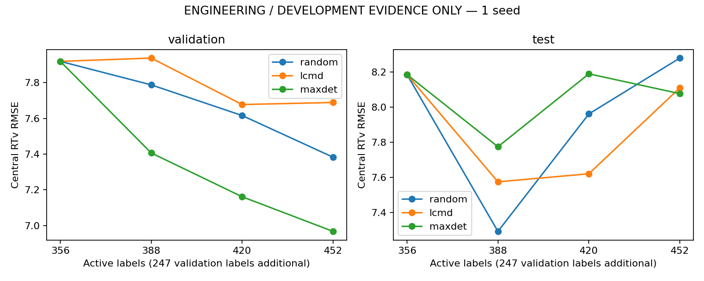

# ODH gradient AL tiny development smoke

**ENGINEERING / DEVELOPMENT EVIDENCE ONLY.** One seed; no winner or independent external-validation claim.

## Frozen training protocol

{
  "maximum_epochs": 300,
  "patience": 100,
  "min_delta": 0.0,
  "initialization_seed": 525,
  "learning_rate": 0.001,
  "weight_decay": 1e-05,
  "optimizer": "Adam",
  "batch_size": 2048,
  "shuffle": false,
  "scheduler": false,
  "loss": "original_q10_pinball_central_MSE_q90_pinball_order_deadtime",
  "checkpoint": "strict_best_eval_central_validation_MSE_earlier_ties",
  "scratch": true,
  "wall_time_limit_seconds": null
}

NRMSE = RMSE / L0 population standard deviation (8.60376056).
Validation 247; active budgets 356/388/420/452; total observed non-test labels 603/635/667/699.

## Diagnostic learning curves

| Split | Method | Budget | RMSE | MAE | R2 | NRMSE |
| --- | --- | ---: | ---: | ---: | ---: | ---: |
| validation | random | 356 | 7.91873 | 5.34069 | 0.18949 | 0.92038 |
| test | random | 356 | 8.18609 | 5.37967 | 0.02983 | 0.95145 |
| validation | random | 388 | 7.78735 | 5.35351 | 0.21616 | 0.90511 |
| test | random | 388 | 7.29359 | 5.06778 | 0.22984 | 0.84772 |
| validation | random | 420 | 7.61574 | 5.24158 | 0.25032 | 0.88516 |
| test | random | 420 | 7.96223 | 5.33987 | 0.08216 | 0.92544 |
| validation | random | 452 | 7.38262 | 5.18454 | 0.29552 | 0.85807 |
| test | random | 452 | 8.28012 | 5.74195 | 0.00741 | 0.96238 |
| validation | lcmd | 356 | 7.91873 | 5.34069 | 0.18949 | 0.92038 |
| test | lcmd | 356 | 8.18609 | 5.37967 | 0.02983 | 0.95145 |
| validation | lcmd | 388 | 7.93709 | 5.31351 | 0.18572 | 0.92251 |
| test | lcmd | 388 | 7.57566 | 5.15846 | 0.16912 | 0.88051 |
| validation | lcmd | 420 | 7.67726 | 5.25228 | 0.23816 | 0.89231 |
| test | lcmd | 420 | 7.62168 | 5.29855 | 0.15900 | 0.88585 |
| validation | lcmd | 452 | 7.68873 | 5.13730 | 0.23589 | 0.89365 |
| test | lcmd | 452 | 8.11077 | 5.55051 | 0.04760 | 0.94270 |
| validation | maxdet | 356 | 7.91873 | 5.34069 | 0.18949 | 0.92038 |
| test | maxdet | 356 | 8.18609 | 5.37967 | 0.02983 | 0.95145 |
| validation | maxdet | 388 | 7.40647 | 5.01937 | 0.29096 | 0.86084 |
| test | maxdet | 388 | 7.77530 | 5.33204 | 0.12476 | 0.90371 |
| validation | maxdet | 420 | 7.16153 | 4.76848 | 0.33708 | 0.83237 |
| test | maxdet | 420 | 8.19032 | 5.51891 | 0.02882 | 0.95195 |
| validation | maxdet | 452 | 6.96777 | 4.73535 | 0.37247 | 0.80985 |
| test | maxdet | 452 | 8.07773 | 5.26882 | 0.05534 | 0.93886 |

## Partial AULC (mean = trapezoidal area / 96; lower is better)

| Split | Method | Mean NRMSE AULC |
| --- | --- | ---: |
| test | lcmd | 0.904479 |
| validation | lcmd | 0.907281 |
| test | maxdet | 0.933605 |
| validation | maxdet | 0.852777 |
| test | random | 0.910026 |
| validation | random | 0.893166 |

## Runtime

| Method | Budget | Epochs / best | Training seconds | Gradient seconds | Acquisition seconds |
| --- | ---: | ---: | ---: | ---: | ---: |
| random | 356 | 234 / 134 | 302.25 | 0.00 | 0.000 |
| random | 388 | 143 / 43 | 190.99 | 0.00 | 0.000 |
| random | 420 | 186 / 86 | 251.03 | 0.00 | 0.000 |
| random | 452 | 158 / 58 | 235.36 | 0.00 | 0.000 |
| lcmd | 356 | 234 / 134 | 302.25 | 81.98 | 0.332 |
| lcmd | 388 | 200 / 100 | 274.53 | 62.79 | 0.133 |
| lcmd | 420 | 189 / 89 | 210.03 | 92.89 | 0.523 |
| lcmd | 452 | 161 / 61 | 327.07 | 0.00 | 0.000 |
| maxdet | 356 | 234 / 134 | 302.25 | 81.98 | 0.847 |
| maxdet | 388 | 163 / 63 | 277.83 | 89.52 | 0.741 |
| maxdet | 420 | 220 / 120 | 443.30 | 115.46 | 0.903 |
| maxdet | 452 | 200 / 100 | 436.60 | 0.00 | 0.000 |

Round-0 training is shared by all methods; round-0 features by LCMD/MaxDet. Actual incremental costs are separate CSV fields.

## Selection overlap

| Pair | Scope | Intersection | Jaccard |
| --- | --- | ---: | ---: |
| random / lcmd | batch_1 | 2 | 0.0323 |
| random / lcmd | batch_2 | 0 | 0.0000 |
| random / lcmd | batch_3 | 1 | 0.0159 |
| random / lcmd | cumulative_96 | 6 | 0.0323 |
| random / maxdet | batch_1 | 0 | 0.0000 |
| random / maxdet | batch_2 | 0 | 0.0000 |
| random / maxdet | batch_3 | 0 | 0.0000 |
| random / maxdet | cumulative_96 | 5 | 0.0267 |
| lcmd / maxdet | batch_1 | 7 | 0.1228 |
| lcmd / maxdet | batch_2 | 3 | 0.0492 |
| lcmd / maxdet | batch_3 | 2 | 0.0323 |
| lcmd / maxdet | cumulative_96 | 26 | 0.1566 |

## Interpretation and stopping decision

{
  "validation": {
    "lcmd": {
      "aulc_relative_improvement": -0.015803294702142395,
      "endpoint_relative_improvement": -0.04146330757721454,
      "descriptive_direction_both_lower": false
    },
    "maxdet": {
      "aulc_relative_improvement": 0.04522054182990045,
      "endpoint_relative_improvement": 0.05619309494159367,
      "descriptive_direction_both_lower": true
    }
  },
  "test": {
    "lcmd": {
      "aulc_relative_improvement": 0.006094773251185283,
      "endpoint_relative_improvement": 0.020452701547294803,
      "descriptive_direction_both_lower": true
    },
    "maxdet": {
      "aulc_relative_improvement": -0.02591001255474684,
      "endpoint_relative_improvement": 0.02444280033748676,
      "descriptive_direction_both_lower": false
    }
  }
}

Conditional recommendation: a separately authorized two-seed/six-round development check; no immediate ten-round or formal expansion. See CRITICAL_REVIEW.md for the contradictory test AULC and other limitations.
No next-stage execution is authorized by this report. A single seed and 96 added labels cannot establish a winner.
The historical fixed test was already exposed during baseline reproduction. This study enforces a new global pre-test barrier but does not create a new independent test cohort.
Later-round overlap compares different current pools. All methods retain identical architecture/loss and scratch initial state.
If performance is flat, inspect extraction audits, zero norms/duplicates, gradient spread, acquisition traces and training curves before adding methods.

## Critical review and execution validation

See [CRITICAL_REVIEW.md](CRITICAL_REVIEW.md) for the validation/test disagreement, weak test R2, high-norm selection bias, one clamped zero-gradient row, cross-task fraction correction, runtime totals and conditional continuation advice. All 247 test rows remain in all primary metrics. Completed-run/report replays added no fits or source test reads.
