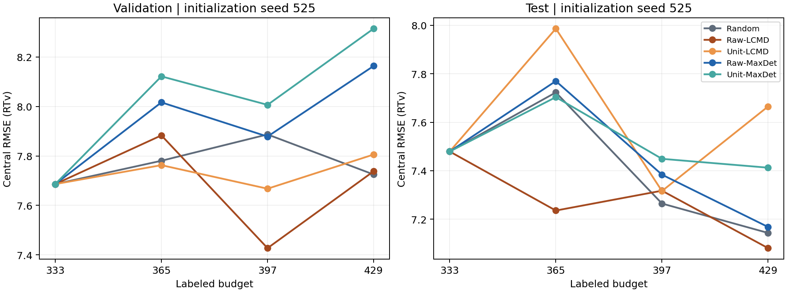

# HPLC transfer_v2：受限短程实验报告

状态：**COMPLETE / STOP**。本实验为 initialization seed 525、5 methods、3 acquisitions；budget 333/365/397/429。未启动 2 seeds × 6 rounds 或其他长程实验。

## Runtime 与 duration gate

使用项目 `.conda-hplc-al/bin/python`，PyTorch 2.2.2、PyG 2.5.3、NumPy 1.23.5，CPU 4 threads，与历史 reproduction 的核心计算依赖一致。Python 小版本为 3.11.16（历史 baseline 为 3.11.14）；不声称解释器环境逐字节相同。

协议 pytest：13 passed；HPLC 全套：78 passed。实际图 batch 检查覆盖 seeds 525/1525 各 500 epochs：same seed + epoch permutation 相同；相邻 epoch 不同；每个 L333 ID 恰好出现一次；图 ID 和 synthetic ID-coded truth 完全对齐；U0/validation/test ID 均未进入 L333 训练排列。每 epoch 恰有 2 steps，实际 batch sizes `[256,77]`。

原始完整 HPLC loss = q10 pinball + central MSE + q90 pinball + 两个 quantile order penalty + dead-time penalty。训练固定 scratch / fresh Adam、batch 256、deterministic_each_epoch、lr 0.001、weight decay 1e-5、max epochs 500、patience 100；checkpoint 仅由 validation central MSE 选择。

| Seed | Best epoch | Stopped epoch | Best step | Best RMSE | MAE | R² | NRMSE | Runtime s | Stop |
| --- | --- | --- | --- | --- | --- | --- | --- | --- | --- |
| 525 | 55 | 155 | 110 | 7.686205 | 5.058523 | 0.236387 | 0.865638 | 89.775958 | patience |
| 1525 | 28 | 128 | 56 | 8.043997 | 5.287642 | 0.163640 | 0.905933 | 99.532620 | patience |

| Seed | Final RMSE | Final MAE | Final R² | Final NRMSE |
| --- | --- | --- | --- | --- |
| 525 | 7.754296 | 5.026336 | 0.222797 | 0.873306 |
| 1525 | 8.540175 | 5.549896 | 0.057279 | 0.961814 |

两组均满足 patience，且 best epoch ≤400；training protocol 已冻结。逐 epoch batch sizes 与 optimizer-step 证据见各 duration_smoke/seed_*/attempt_000/training_curve.csv。

## 实现审计与中断恢复

`phi_raw = 512D CountSketch(full-network central gradient)`；`phi_unit = phi_raw / max(||phi_raw||₂, 1e-12)`。Unit 方法的准确名称是 **unit-normalized sketched gradient**。梯度提取为 eval 模式，中心输出列为 1，未使用 U truth。

五方法在 L333 共享 duration seed 525 的 exact same predictor checkpoint、同一个 raw 512D gradient bank，Unit 仅由该 raw bank row-wise normalization 得到。首轮 acquisition 后，按各自 labeled ID sets scratch retrain。每个后续预算独立 fresh Adam，无 warm start。

已有中断尝试保存在 interrupted_attempt_20260923。旧 AL 入口缺少 4-thread 环境固定，默认环境为 10 threads；实际旧 fit 线程数未记录。其 L333 checkpoint 与相同输入/初始化的 4-thread duration fit 不同，不能将旧 fit 混入本次配对比较。复用已验证的 duration checkpoint，重新进行统一环境下的后续 fits。旧 Random L365 后的 None gradient audit 引用错误已修复；acquisition selector、随机序列算法和 scientific hyperparameters 均未改变。

冻结前已验证全部 20 个 method-budget 状态、checkpoint、validation/test-X predictions、selection 的文件哈希；test truth 仅在全局 freeze 后统一 reveal 一次。末预算无后续 acquisition，selection 为空，state 保留。预测文件按显式 IDs 合并存储 validation + test-X。

## Learning curves

### validation central RMSE

| Method | 333 | 365 | 397 | 429 |
| --- | --- | --- | --- | --- |
| Random | 7.686205 | 7.780393 | 7.886718 | 7.724913 |
| Raw-LCMD | 7.686205 | 7.882952 | 7.427372 | 7.737972 |
| Unit-LCMD | 7.686205 | 7.762635 | 7.667519 | 7.805586 |
| Raw-MaxDet | 7.686205 | 8.016350 | 7.878247 | 8.163468 |
| Unit-MaxDet | 7.686205 | 8.121395 | 8.006314 | 8.314370 |

### test central RMSE

| Method | 333 | 365 | 397 | 429 |
| --- | --- | --- | --- | --- |
| Random | 7.479338 | 7.723160 | 7.264689 | 7.143340 |
| Raw-LCMD | 7.479338 | 7.235745 | 7.317668 | 7.080658 |
| Unit-LCMD | 7.479338 | 7.986440 | 7.316293 | 7.665269 |
| Raw-MaxDet | 7.479338 | 7.769971 | 7.383853 | 7.167933 |
| Unit-MaxDet | 7.479338 | 7.703614 | 7.449173 | 7.412613 |

### 所有 budget 的完整指标

NRMSE = RMSE / frozen L333 population SD，SD = 8.879240548。所有方法和预算共用此分母。

#### validation

| Method | Budget | RMSE | MAE | R² | NRMSE |
| --- | --- | --- | --- | --- | --- |
| Random | 333 | 7.686205 | 5.058523 | 0.236387 | 0.865638 |
| Random | 365 | 7.780393 | 5.015982 | 0.217557 | 0.876245 |
| Random | 397 | 7.886718 | 4.805841 | 0.196026 | 0.888220 |
| Random | 429 | 7.724913 | 4.862150 | 0.228676 | 0.869997 |
| Raw-LCMD | 333 | 7.686205 | 5.058523 | 0.236387 | 0.865638 |
| Raw-LCMD | 365 | 7.882952 | 5.109001 | 0.196793 | 0.887796 |
| Raw-LCMD | 397 | 7.427372 | 4.756010 | 0.286950 | 0.836487 |
| Raw-LCMD | 429 | 7.737972 | 4.891349 | 0.226066 | 0.871468 |
| Unit-LCMD | 333 | 7.686205 | 5.058523 | 0.236387 | 0.865638 |
| Unit-LCMD | 365 | 7.762635 | 4.931098 | 0.221125 | 0.874245 |
| Unit-LCMD | 397 | 7.667519 | 4.834685 | 0.240095 | 0.863533 |
| Unit-LCMD | 429 | 7.805586 | 5.041586 | 0.212482 | 0.879083 |
| Raw-MaxDet | 333 | 7.686205 | 5.058523 | 0.236387 | 0.865638 |
| Raw-MaxDet | 365 | 8.016350 | 5.008262 | 0.169379 | 0.902819 |
| Raw-MaxDet | 397 | 7.878247 | 5.325259 | 0.197752 | 0.887266 |
| Raw-MaxDet | 429 | 8.163468 | 5.106631 | 0.138612 | 0.919388 |
| Unit-MaxDet | 333 | 7.686205 | 5.058523 | 0.236387 | 0.865638 |
| Unit-MaxDet | 365 | 8.121395 | 5.406834 | 0.147468 | 0.914650 |
| Unit-MaxDet | 397 | 8.006314 | 5.235564 | 0.171457 | 0.901689 |
| Unit-MaxDet | 429 | 8.314370 | 5.387784 | 0.106472 | 0.936383 |

#### test

| Method | Budget | RMSE | MAE | R² | NRMSE |
| --- | --- | --- | --- | --- | --- |
| Random | 333 | 7.479338 | 5.142232 | 0.190118 | 0.842340 |
| Random | 365 | 7.723160 | 5.291979 | 0.136454 | 0.869800 |
| Random | 397 | 7.264689 | 4.750138 | 0.235936 | 0.818166 |
| Random | 429 | 7.143340 | 4.808744 | 0.261249 | 0.804499 |
| Raw-LCMD | 333 | 7.479338 | 5.142232 | 0.190118 | 0.842340 |
| Raw-LCMD | 365 | 7.235745 | 4.771031 | 0.242012 | 0.814906 |
| Raw-LCMD | 397 | 7.317668 | 4.883316 | 0.224751 | 0.824132 |
| Raw-LCMD | 429 | 7.080658 | 4.748583 | 0.274157 | 0.797440 |
| Unit-LCMD | 333 | 7.479338 | 5.142232 | 0.190118 | 0.842340 |
| Unit-LCMD | 365 | 7.986440 | 5.271408 | 0.076574 | 0.899451 |
| Unit-LCMD | 397 | 7.316293 | 4.942155 | 0.225043 | 0.823977 |
| Unit-LCMD | 429 | 7.665269 | 4.999301 | 0.149351 | 0.863280 |
| Raw-MaxDet | 333 | 7.479338 | 5.142232 | 0.190118 | 0.842340 |
| Raw-MaxDet | 365 | 7.769971 | 5.205585 | 0.125954 | 0.875072 |
| Raw-MaxDet | 397 | 7.383853 | 5.093419 | 0.210664 | 0.831586 |
| Raw-MaxDet | 429 | 7.167933 | 4.855909 | 0.256153 | 0.807269 |
| Unit-MaxDet | 333 | 7.479338 | 5.142232 | 0.190118 | 0.842340 |
| Unit-MaxDet | 365 | 7.703614 | 5.327557 | 0.140819 | 0.867598 |
| Unit-MaxDet | 397 | 7.449173 | 5.005022 | 0.196637 | 0.838943 |
| Unit-MaxDet | 429 | 7.412613 | 5.020285 | 0.204504 | 0.834825 |

## Normalized AULC 333–429

使用梯形积分。budget-normalized AULC RMSE = ∫RMSE dB /96；normalized AULC NRMSE = ∫NRMSE dB /96。二者越低越好。另给出相对 Random 的 AULC 比值；1 表示与 Random 相同。

| Method | Split | Mean RMSE AULC | Normalized NRMSE AULC | Ratio / Random |
| --- | --- | --- | --- | --- |
| Random | validation | 7.790890 | 0.877427 | 1.000000 |
| Random | test | 7.433063 | 0.837128 | 1.000000 |
| Raw-LCMD | validation | 7.674137 | 0.864279 | 0.985014 |
| Raw-LCMD | test | 7.277804 | 0.819643 | 0.979112 |
| Unit-LCMD | validation | 7.725350 | 0.870046 | 0.991588 |
| Unit-LCMD | test | 7.625012 | 0.858746 | 1.025824 |
| Raw-MaxDet | validation | 7.939811 | 0.894199 | 1.019115 |
| Raw-MaxDet | test | 7.492486 | 0.843821 | 1.007995 |
| Unit-MaxDet | validation | 8.042666 | 0.905783 | 1.032317 |
| Unit-MaxDet | test | 7.532921 | 0.848374 | 1.013434 |

## Paired comparisons

差值为 A − B；RMSE/MAE/NRMSE 负值有利于 A，R² 正值有利于 A。仅一条 seed trajectory，不能进行跨 seed 稳定性或显著性判断。

### validation paired RMSE / AULC

| A − B | 333 | 365 | 397 | 429 | Δ normalized AULC |
| --- | --- | --- | --- | --- | --- |
| Raw-LCMD − Unit-LCMD | 0.000000 | 0.120317 | -0.240147 | -0.067614 | -0.005768 |
| Raw-MaxDet − Unit-MaxDet | 0.000000 | -0.105046 | -0.128068 | -0.150902 | -0.011584 |
| Raw-LCMD − Random | 0.000000 | 0.102559 | -0.459346 | 0.013059 | -0.013149 |
| Unit-LCMD − Random | 0.000000 | -0.017758 | -0.219199 | 0.080673 | -0.007381 |
| Raw-MaxDet − Random | 0.000000 | 0.235956 | -0.008471 | 0.438555 | 0.016772 |
| Unit-MaxDet − Random | 0.000000 | 0.341002 | 0.119597 | 0.589457 | 0.028356 |

### test paired RMSE / AULC

| A − B | 333 | 365 | 397 | 429 | Δ normalized AULC |
| --- | --- | --- | --- | --- | --- |
| Raw-LCMD − Unit-LCMD | 0.000000 | -0.750695 | 0.001376 | -0.584610 | -0.039103 |
| Raw-MaxDet − Unit-MaxDet | 0.000000 | 0.066357 | -0.065320 | -0.244681 | -0.004554 |
| Raw-LCMD − Random | 0.000000 | -0.487414 | 0.052979 | -0.062681 | -0.017486 |
| Unit-LCMD − Random | 0.000000 | 0.263281 | 0.051603 | 0.521929 | 0.021618 |
| Raw-MaxDet − Random | 0.000000 | 0.046812 | 0.119164 | 0.024593 | 0.006692 |
| Unit-MaxDet − Random | 0.000000 | -0.019546 | 0.184484 | 0.269273 | 0.011246 |

全部 RMSE/MAE/R²/NRMSE paired differences 见 [paired_differences.csv](results/paired_differences.csv)。

## Acquisition geometry

Norm percentile/top-decile 以当轮 U pool 为参照；CSV 也提供 outer-train 参照。有效秩采用中心化 selected feature matrix 的 singular-value entropy：`exp(-Σ p log p)`，`p = singular value / sum`；与 algebraic matrix rank 分开记录。距离在 raw、unit 空间分别计算。Random 的梯度只用于诊断，不影响 selection。

| Method | From B | Norm pct | Top 10% frac | Raw eff.rank | Unit eff.rank | Raw pair dist | Unit pair dist | Raw nearest-L | Unit nearest-L |
| --- | --- | --- | --- | --- | --- | --- | --- | --- | --- |
| Random | 333 | 50.865186 | 0.187500 | 22.828018 | 25.471598 | 603.736028 | 1.163651 | 260.499822 | 0.528769 |
| Random | 365 | 50.297036 | 0.062500 | 24.933733 | 26.757547 | 738.227774 | 1.154745 | 303.991726 | 0.460792 |
| Random | 397 | 52.599537 | 0.156250 | 24.391521 | 26.964768 | 817.942516 | 1.161620 | 350.994108 | 0.504486 |
| Raw-LCMD | 333 | 94.318182 | 0.781250 | 25.598745 | 26.433325 | 985.753995 | 1.012963 | 644.943259 | 0.671630 |
| Raw-LCMD | 365 | 93.658899 | 0.781250 | 25.700401 | 26.519102 | 1168.970960 | 1.136178 | 731.521172 | 0.770128 |
| Raw-LCMD | 397 | 93.804012 | 0.781250 | 25.203951 | 26.599020 | 1286.931790 | 1.177227 | 782.889025 | 0.785634 |
| Unit-LCMD | 333 | 58.281934 | 0.125000 | 25.257567 | 27.351903 | 610.196639 | 1.127857 | 370.442402 | 0.764054 |
| Unit-LCMD | 365 | 65.975625 | 0.125000 | 26.238774 | 27.719099 | 749.428819 | 1.194494 | 470.104585 | 0.827697 |
| Unit-LCMD | 397 | 46.500772 | 0.156250 | 22.168043 | 27.278549 | 923.055415 | 1.116277 | 499.377371 | 0.718480 |
| Raw-MaxDet | 333 | 98.420789 | 1.000000 | 25.590911 | 25.976074 | 1299.637111 | 1.054889 | 801.423307 | 0.653812 |
| Raw-MaxDet | 365 | 98.980279 | 1.000000 | 26.425338 | 26.596801 | 1351.517373 | 1.097159 | 842.412666 | 0.720305 |
| Raw-MaxDet | 397 | 97.314815 | 0.906250 | 24.251924 | 25.091620 | 1262.164063 | 1.118390 | 514.805561 | 0.491076 |
| Unit-MaxDet | 333 | 51.291322 | 0.093750 | 23.738729 | 27.624577 | 658.240867 | 1.226817 | 367.799499 | 0.766549 |
| Unit-MaxDet | 365 | 30.137647 | 0.000000 | 25.412817 | 28.437620 | 604.369459 | 1.198480 | 351.432596 | 0.758542 |
| Unit-MaxDet | 397 | 31.797068 | 0.031250 | 25.459794 | 28.463307 | 684.335436 | 1.196899 | 350.168938 | 0.646967 |

| Pair | From B | Overlap /32 | Jaccard | Cumulative acquired Jaccard |
| --- | --- | --- | --- | --- |
| Raw-LCMD / Unit-LCMD | 333 | 0 | 0.000000 | 0.000000 |
| Raw-LCMD / Unit-LCMD | 365 | 0 | 0.000000 | 0.007874 |
| Raw-LCMD / Unit-LCMD | 397 | 0 | 0.000000 | 0.015873 |
| Raw-MaxDet / Unit-MaxDet | 333 | 2 | 0.032258 | 0.032258 |
| Raw-MaxDet / Unit-MaxDet | 365 | 0 | 0.000000 | 0.015873 |
| Raw-MaxDet / Unit-MaxDet | 397 | 1 | 0.015873 | 0.037838 |

Round 0 的 Raw/Unit 比较共享模型和候选集，因此可直接比较 normalization 对 geometry 的影响。后续轮模型、L/U 集均已分叉，几何差异同时包含 trajectory 的影响。

## Compute

| Quantity | Value |
| --- | --- |
| valid_AL_unique_fits | 16 |
| AL_new_fits_this_continuation | 15 |
| AL_round0_reused_duration_fit | True |
| valid_AL_unique_gradient_passes | 11 |
| acquisition_gradient_passes | 9 |
| random_diagnostic_gradient_passes | 2 |
| training_seconds_including_reused_seed525 | 3213.712910 |
| new_AL_training_seconds | 3123.936953 |
| gradient_extraction_seconds | 858.359998 |
| selector_seconds | 5.236228 |
| duration_seed1525_extra_seconds | 99.532620 |
| valid_work_unique_fits_including_duration | 17 |
| archived_unique_fits | 2 |
| archived_unique_gradient_passes | 1 |
| archived_training_seconds | 389.335544 |
| archived_gradient_seconds | 95.318513 |
| total_executed_unique_fits | 19 |
| total_executed_unique_gradient_passes | 12 |

| Method | New training s | Gradient s excl shared | Selector s |
| --- | --- | --- | --- |
| Random | 546.858104 | 148.481311 | 0.001269 |
| Raw-LCMD | 813.961251 | 113.427838 | 0.675814 |
| Unit-LCMD | 478.098283 | 113.952127 | 0.582588 |
| Raw-MaxDet | 644.357343 | 219.074936 | 1.186555 |
| Unit-MaxDet | 640.661971 | 211.527071 | 2.790002 |

共享 L333 fit 的成本只计一次；其与 duration seed 525 为同一物理 fit。有效 AL 16 unique fits，另有 duration seed 1525；中断尝试的额外 fits/gradient pass 单独报告，不混入有效曲线。末预算无需 gradient extraction；Random rounds 1/2 两次 gradient passes 为 geometry diagnostics。

所有 AL fit 的 best/stopped epochs、optimizer steps、actual batch sizes 和 stopping reason 见 [training_duration_all_fits.csv](results/training_duration_all_fits.csv)。

## 解释边界

本次是单 seed、三个 acquisition 的初步比较；预算间表现一致只能支持短程迹象，不能证明跨初始化或跨 split 稳定改善。历史 HPLC test 曾用于早期工程研究，本次 reveal firewall 防止当前 acquisition/checkpoint 读取 test truth，但该 test 不是从未使用过的新外部验证集。

## 决策

修正后的 training protocol 在这个单 seed、三个 acquisition 的短程实验中出现有限改善迹象：Raw-LCMD 的 test normalized AULC 为 0.819643，Random 为 0.837128；但这不是跨 seed 的稳定性证据。

Unit normalization 没有改善 label efficiency；它改变了 acquisition geometry，但本次没有带来预测改善。Raw-LCMD 比 MaxDet 更值得进入下一阶段，MaxDet 两个变体都没有超过 Random。当前证据不足以直接授权 2 seeds × 6 rounds；若推进，应视为验证性复现。

## Evidence index

- [Runtime preflight](runtime_gate/runtime_preflight.json)
- [Protocol pytest](runtime_gate/test_transfer_v2_protocol_resume.log)
- [Full HPLC pytest](runtime_gate/test_hplc_al_resume.log)
- [Duration smoke](duration_smoke/summary.json)
- [Frozen training protocol](training_protocol_frozen.json)
- [Implementation audit](implementation_audit.json)
- [Global pre-test freeze](global_pre_test_freeze.json)
- [Single test reveal](test_reveal.json)
- [Result summary](results/summary.json)
- [Learning curve CSV](results/learning_curves.csv)
- [Geometry CSV](results/acquisition_geometry.csv)
- [Compute JSON](results/compute.json)
