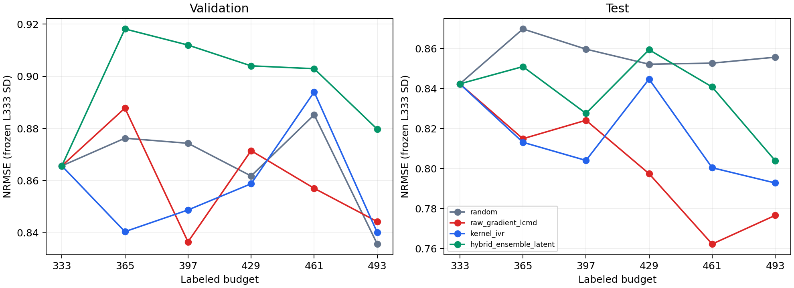

# ODH Kernel-IVR / Hybrid development screen

Seed 525 only; fixed L333–L493 schedule; hard stop at L493. The same test cohort was exposed in historical work, so these results are exploratory development evidence.

## Source transfer and comparability

CC Kernel-IVR exact mechanism: fixed original outer-training reference, one global gradient RMS, unit prior/noise, scalar row-kernel IVR, Sherman–Morrison greedy conditioning after every pick. HPLC feature adaptation: its full-network central RTv `output[:,1]` 512D CountSketch instead of CC endpoint-scaled concatenation. Prior/noise, batch size, reference and numerical objective remained frozen.

CC Hybrid principle: three-model epistemic uncertainty → Top-25% shortlist → latent k-center. HPLC adaptation: scalar central RTv std with `ddof=0`, unit `h_graph`, and cosine distance because raw HPLC latent norm correlates with molecule size. This is not a direct or bitwise CC Hybrid reproduction. K=3, 25%, B=32, seeds and training protocol remained frozen.

Historical Random and Raw Gradient-LCMD artifacts were reused read-only. Their partition, L333 IDs, training contract, source checkpoint, validation/test-X prediction IDs, budget transitions, target, metric and NRMSE denominator passed the comparator audit. Their test metrics were independently recomputed only after the new global freeze. The two new methods share the exact L333 checkpoint and test-X prediction file contents; later states branch independently.

## Primary AULC (test NRMSE; lower is better)

| Method | Early 333–429 | Extension 429–493 | Full 333–493 | Full / Random | Full / LCMD |
|---|---:|---:|---:|---:|---:|
| random | 0.858918 | 0.853316 | 0.856677 | 1.0000 | 1.0687 |
| raw_gradient_lcmd | 0.819643 | 0.774628 | 0.801637 | 0.9358 | 1.0000 |
| kernel_ivr | 0.820240 | 0.809581 | 0.815976 | 0.9525 | 1.0179 |
| hybrid_ensemble_latent | 0.843140 | 0.836232 | 0.840377 | 0.9810 | 1.0483 |

## Per-budget test metrics

| Method | Budget | RMSE | MAE | R² | NRMSE |
|---|---:|---:|---:|---:|---:|
| random | 333 | 7.4793 | 5.1422 | 0.1901 | 0.8423 |
| random | 365 | 7.7232 | 5.2920 | 0.1365 | 0.8698 |
| random | 397 | 7.6335 | 5.0576 | 0.1564 | 0.8597 |
| random | 429 | 7.5666 | 4.9875 | 0.1711 | 0.8522 |
| random | 461 | 7.5714 | 5.0697 | 0.1701 | 0.8527 |
| random | 493 | 7.5978 | 5.0422 | 0.1643 | 0.8557 |
| raw_gradient_lcmd | 333 | 7.4793 | 5.1422 | 0.1901 | 0.8423 |
| raw_gradient_lcmd | 365 | 7.2357 | 4.7710 | 0.2420 | 0.8149 |
| raw_gradient_lcmd | 397 | 7.3177 | 4.8833 | 0.2248 | 0.8241 |
| raw_gradient_lcmd | 429 | 7.0807 | 4.7486 | 0.2742 | 0.7974 |
| raw_gradient_lcmd | 461 | 6.7681 | 4.5521 | 0.3368 | 0.7622 |
| raw_gradient_lcmd | 493 | 6.8955 | 4.5314 | 0.3116 | 0.7766 |
| kernel_ivr | 333 | 7.4793 | 5.1422 | 0.1901 | 0.8423 |
| kernel_ivr | 365 | 7.2200 | 4.8391 | 0.2453 | 0.8131 |
| kernel_ivr | 397 | 7.1394 | 4.6814 | 0.2621 | 0.8041 |
| kernel_ivr | 429 | 7.5006 | 4.9866 | 0.1855 | 0.8447 |
| kernel_ivr | 461 | 7.1070 | 4.7526 | 0.2687 | 0.8004 |
| kernel_ivr | 493 | 7.0393 | 5.0968 | 0.2826 | 0.7928 |
| hybrid_ensemble_latent | 333 | 7.4793 | 5.1422 | 0.1901 | 0.8423 |
| hybrid_ensemble_latent | 365 | 7.5560 | 5.2913 | 0.1734 | 0.8510 |
| hybrid_ensemble_latent | 397 | 7.3483 | 4.8156 | 0.2183 | 0.8276 |
| hybrid_ensemble_latent | 429 | 7.6309 | 5.0808 | 0.1570 | 0.8594 |
| hybrid_ensemble_latent | 461 | 7.4657 | 4.9946 | 0.1931 | 0.8408 |
| hybrid_ensemble_latent | 493 | 7.1382 | 4.7854 | 0.2623 | 0.8039 |

## Acquisition mechanism and cost

Batch overlap counts with Raw Gradient-LCMD at acquisition budgets [333, 365, 397, 429, 461]: IVR [5, 4, 0, 1, 0]; Hybrid [0, 1, 0, 0, 1]. IVR–Hybrid overlap: [0, 0, 1, 1, 0]. Detailed Jaccard and IDs are in `results/selection_overlap.csv`.

IVR initial score distribution, integrated variance before/after, predicted reduction, denominator and condition diagnostics are in each IVR `selection.json`; the CSV summarizes norm and score percentiles. Hybrid shortlist thresholds, uncertainty percentiles, retained top uncertainty ranks, latent distance, Morgan novelty and scaffold fraction are in its `selection.json` and the CSV. Morgan is diagnostic only.

| Method | New evaluation fits | Extra ensemble fits | New epochs | Training seconds |
|---|---:|---:|---:|---:|
| kernel_ivr | 5 | 0 | 971 | 855.9 |
| hybrid_ensemble_latent | 5 | 10 | 2463 | 2040.3 |

## Scientific interpretation

Q1. A scalar RTv makes the IVR surrogate directly aligned with the single evaluated output; that is a modeling simplification, not proof of superiority. IVR full AULC is 0.815976 versus Random 0.856677, a 4.75% descriptive gain. It does not beat LCMD.

Q2. IVR and LCMD share the gradient representation at L333 and refresh that same feature definition from their own checkpoint thereafter. Their full AULCs are 0.815976 and 0.801637; first-batch overlap 5/32 at the identical initial state, and only 10/160 picks overlap across all five rounds. The first difference is attributable to acquisition objective; later performance also includes trajectory-induced model changes. IVR is nearly tied on early AULC but loses on extension AULC.

Q3. Hybrid full AULC is 0.840377. Across five batches, selected uncertainty percentile averages 85.70 versus shortlist 87.49; only 4/160 selected samples retain a Top-32 uncertainty rank. Diversity preserves generally high disagreement but removes most extreme uncertainty picks. The resulting trajectory does not beat LCMD, so this screen does not show added label efficiency from ensemble disagreement beyond the gradient baseline.

Q4. Historical Latent-Coreset full AULC was 0.848435, versus Hybrid 0.840377; its L493 test NRMSE was 0.854118, versus Hybrid 0.803922. Hybrid improves on this mechanism background within seed 525, but Latent-Coreset is not a primary comparator.

Q5. LCMD test NRMSE at L461/L493 is [0.7622438521813151, 0.7765862419795342]; its extension AULC is 0.774628 versus Random 0.853316, IVR 0.809581, and Hybrid 0.836232. Its late-budget advantage persists in this seed.

Q6. The fixed practical gate recommends **raw_gradient_lcmd** for the next confirmation stage. The minimum follow-up is Random versus Raw Gradient-LCMD on seeds 1525 and 2525. No such run was started.

No significance conclusion is available from one seed. Validation selected every checkpoint; IVR validation full AULC (0.858946) is slightly lower than LCMD (0.861543), while their test ordering reverses. Historical test exposure means this cohort is not an independent fresh external test, despite the new computational test-truth firewall. Unit prior/noise and global gradient RMS remain surrogate assumptions; no tuning was conducted.

