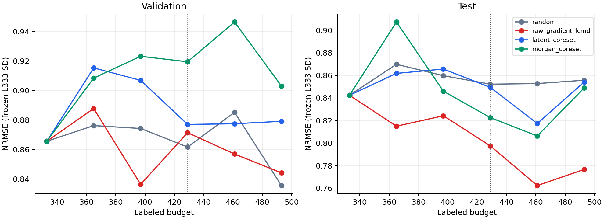

# ODH representation coreset: adaptive round extension

同一 seed 525、同四方法，从已冻结 L429 checkpoint 接续。先跑两个新增预算点；每两个新点以 validation NRMSE 检查 Latent/Morgan 是否至少一次比同预算 Raw Gradient-LCMD 低 0.01。阳性则再跑两个点，否则停止。最多新增 8 轮。

**实际停止**：budget 493，原因 `no_signal`；新增 2 个预算点。

## Validation-only 决策轨迹

| 检查时预算 | 新预算点 | Latent 相对 LCMD 改善 | Morgan 相对 LCMD 改善 | 阳性方法 |
|---:|---:|---:|---:|---|
| 493 | 461 | -0.0205 | -0.0893 | none |
| 493 | 493 | -0.0349 | -0.0587 | none |

正数表示 coreset 的 validation NRMSE 更低。任一新预算点达到 ≥0.01 就继续下一对预算点。没有用 test 指标参与停止决策。

## 学习曲线与 AULC

AULC 均为 NRMSE 随 labeled budget 的梯形积分除以对应区间宽度；越低越好。

| 方法 | Validation 全程 | Test 全程 | Test 429→停止点 | Test 扩展段 / Random |
|---|---:|---:|---:|---:|
| random | 0.869630 | 0.856677 | 0.853316 | 1.0000 |
| raw_gradient_lcmd | 0.861543 | 0.801637 | 0.774628 | 0.9078 |
| latent_coreset | 0.889828 | 0.848435 | 0.834498 | 0.9779 |
| morgan_coreset | 0.916339 | 0.845528 | 0.820974 | 0.9621 |

## 每预算点 test 结果

| 方法 | Budget | RMSE | MAE | R² | NRMSE |
|---|---:|---:|---:|---:|---:|
| random | 333 | 7.4793 | 5.1422 | 0.1901 | 0.8423 |
| random | 365 | 7.7232 | 5.2920 | 0.1365 | 0.8698 |
| random | 397 | 7.6335 | 5.0576 | 0.1564 | 0.8597 |
| random | 429 | 7.5666 | 4.9875 | 0.1711 | 0.8522 |
| random | 461 | 7.5714 | 5.0697 | 0.1701 | 0.8527 |
| random | 493 | 7.5978 | 5.0422 | 0.1643 | 0.8557 |
| raw_gradient_lcmd | 333 | 7.4793 | 5.1422 | 0.1901 | 0.8423 |
| raw_gradient_lcmd | 365 | 7.2357 | 4.7710 | 0.2420 | 0.8149 |
| raw_gradient_lcmd | 397 | 7.3177 | 4.8833 | 0.2248 | 0.8241 |
| raw_gradient_lcmd | 429 | 7.0807 | 4.7486 | 0.2742 | 0.7974 |
| raw_gradient_lcmd | 461 | 6.7681 | 4.5521 | 0.3368 | 0.7622 |
| raw_gradient_lcmd | 493 | 6.8955 | 4.5314 | 0.3116 | 0.7766 |
| latent_coreset | 333 | 7.4793 | 5.1422 | 0.1901 | 0.8423 |
| latent_coreset | 365 | 7.6515 | 5.3025 | 0.1524 | 0.8617 |
| latent_coreset | 397 | 7.6858 | 5.2973 | 0.1448 | 0.8656 |
| latent_coreset | 429 | 7.5417 | 5.3253 | 0.1765 | 0.8494 |
| latent_coreset | 461 | 7.2566 | 4.9514 | 0.2376 | 0.8173 |
| latent_coreset | 493 | 7.5839 | 4.9952 | 0.1673 | 0.8541 |
| morgan_coreset | 333 | 7.4793 | 5.1422 | 0.1901 | 0.8423 |
| morgan_coreset | 365 | 8.0561 | 5.5183 | 0.0604 | 0.9073 |
| morgan_coreset | 397 | 7.5115 | 5.0431 | 0.1831 | 0.8460 |
| morgan_coreset | 429 | 7.3035 | 5.0892 | 0.2277 | 0.8225 |
| morgan_coreset | 461 | 7.1587 | 4.7628 | 0.2581 | 0.8062 |
| morgan_coreset | 493 | 7.5376 | 4.9746 | 0.1774 | 0.8489 |

## 选样覆盖与交集

每轮的梯度范数、latent/Morgan novelty 百分位、scaffold 新颖度、分子大小和分子量见 results/acquisition_geometry.csv；完整池/选中分布见各轮 coverage.json。新轮次的 LCMD 与两种 coreset 交集如下。

| Budget | 比较 | 共同 IDs | Jaccard |
|---:|---|---:|---:|
| 429 | raw_gradient_lcmd vs latent_coreset | 1 | 0.0159 |
| 429 | raw_gradient_lcmd vs morgan_coreset | 1 | 0.0159 |
| 461 | raw_gradient_lcmd vs latent_coreset | 0 | 0.0000 |
| 461 | raw_gradient_lcmd vs morgan_coreset | 0 | 0.0000 |

## 解释与限制

本次扩展段 test AULC 最低的方法是 **raw_gradient_lcmd**。该排序只描述 seed 525 的轨迹。停止规则和 checkpoint 选择均使用 validation，因此继续轮次本身是适应 validation 的过程；本研究不据此作显著性结论。

先前 study 的 test truth 已经揭示。本次扩展在新轮次全部冻结后统一评估 test，但它仍是同一开发数据集，不能作为独立外部验证。原 study 和旧历史 artifacts 保持不可变。

如果在 685 达到上限且最后一个 validation 检查仍为阳性，结论应是“达到预定上限，信号仍在”，不能称为“没有积极信号而停止”。
