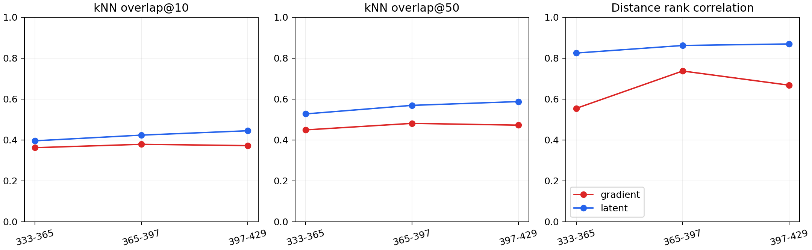
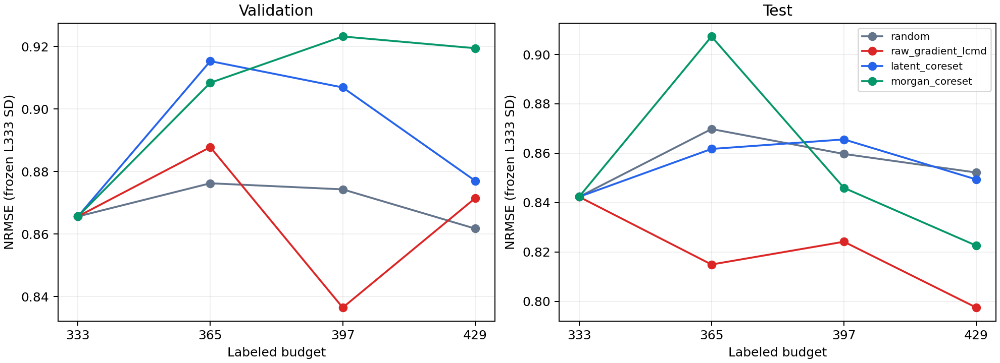

# ODH representation coreset v1

完成范围：seed 525；4 方法；333→365→397→429；3 次 acquisition。已停止，不扩 seed、budget 或方法。

## 协议与审计

- 当前 main 基线为 3c15d0a。全部历史 study 文件在开始和完成时逐项 SHA-256 对比。
- 四方法共享同一 L333 IDs、checkpoint、validation 和 test-X predictions。Raw Gradient-LCMD 的冻结轨迹按相同 IDs、训练配置和 checkpoint 校验复用；未重新运行历史 selector。
- 新 Random 使用 seed 525900001 对排序 U0 仅置换一次，之后依次取 [0:32]、[32:64]、[64:96]。不与历史 Random 混用。
- 其余新增轮次使用 batch 256、deterministic_each_epoch、max 500 epochs、patience 100、lr .001、weight decay 1e-5、scratch/fresh Adam、无 scheduler、完整原始 loss 和仅 validation 选 checkpoint。
- training_seed metadata 修复仅影响未来记录；历史 initialization_seed=training_seed=525，因此不改变或重新解释历史数值。
- h_graph 为 G atom-bond 与 H bond-angle 信息融合、global_add_pool 后的 128D task-aware latent；还包含键长、i-PrOH 条件以及 TPSA/RASA/RPSA/MDEC/MATS 信息，不能称为纯结构指纹。
- Latent 使用单位化后 1−cosine 距离；Morgan 使用 radius=2、2048 bits、includeChirality=True、1−Tanimoto。K-center 以 current L 为初始中心，精确并列时取最小 ID。
- 各方法每轮使用自身当前 checkpoint 提取 latent 和 gradient；Morgan 固定。全部 16 个 method/budget 记录及预测先冻结，校验后仅统一读取一次 test truth。
- NRMSE 分母为冻结 L333 population SD=8.8792405476。normalized AULC=NRMSE 在 333–429 的梯形积分/96。

## 表征诊断

L333 outer-train latent cosine distance 与 Morgan Tanimoto distance 的 Spearman=0.1357（50,000 对有放回随机样本对，无自身配对，seed 525）。这是描述性关联，不是 task label 预测能力证明。

| latent norm vs size | Spearman | Pearson |
|---|---:|---:|
| graph_atom_count | 0.5385 | 0.3100 |
| rdkit_atom_count | 0.5385 | 0.3100 |
| heavy_atom_count | 0.5385 | 0.3100 |

图 atom count 含缓存图的节点；RDKit atom count 不包含隐式 H，可能与 heavy atom count 相同。norm 与尺寸关联为使用 unit latent 的依据，但不说明它是唯一影响因素。

手性诊断：观察到 1578 对显式四面体镜像分子；启用 chirality 可区分 1578 对，关闭时可区分 0 对。未指定、轴手性与非四面体手性不作推断。完整镜像配对和诊断保存在 diagnostics/chirality.json。

## Gradient 与 latent 稳定性

固定候选为 Raw Gradient-LCMD 的 U429 中随机选取的 512 个 IDs，在四个 checkpoint 上保持完全一致。Gradient 的邻域/距离秩采用 raw CountSketch 欧氏距离，latent 采用 unit cosine；坐标逐行 cosine 单独报告。历史前 3 个 gradient bank 直接读取，仅为 L429 提取缺少的 bank。

| checkpoint pair | representation | row cosine | norm-rank ρ | kNN@10 | kNN@50 | distance-rank ρ |
|---|---|---:|---:|---:|---:|---:|
| 333-365 | gradient | 0.4069 | 0.6029 | 0.3619 | 0.4488 | 0.5542 |
| 333-365 | latent | 0.8300 | — | 0.3955 | 0.5269 | 0.8243 |
| 365-397 | gradient | 0.4133 | 0.7885 | 0.3783 | 0.4806 | 0.7365 |
| 365-397 | latent | 0.8293 | — | 0.4232 | 0.5686 | 0.8612 |
| 397-429 | gradient | 0.3834 | 0.7457 | 0.3721 | 0.4720 | 0.6674 |
| 397-429 | latent | 0.8478 | — | 0.4445 | 0.5871 | 0.8687 |

不同 scratch checkpoint 的坐标 cosine 也可能受表示基底变化影响；邻域和距离排序更直接衡量几何稳定性。本诊断沿 LCMD 轨迹开展，不能替代所有方法的稳定性比较。

## 历史 acquisition 的 coverage

只读取历史已冻结 batch，不重跑 selector。每轮以该方法 current L/U 计算 novelty；latent 始终使用共享 L333 checkpoint，以固定参考几何比较历史轨迹。百分位为 current U 的 midrank，重复分子同等处理。

| method | budget | Morgan novelty percentile | latent novelty percentile | novel scaffold fraction | heavy atoms mean | heavy atom percentile |
|---|---:|---:|---:|---:|---:|---:|
| random | 333 | 52.29 | 51.99 | 0.375 | 21.53 | 51.03 |
| random | 365 | 37.44 | 44.52 | 0.344 | 20.59 | 48.29 |
| random | 397 | 46.69 | 47.60 | 0.188 | 21.84 | 51.11 |
| raw_gradient_lcmd | 333 | 64.58 | 37.97 | 0.594 | 19.06 | 40.89 |
| raw_gradient_lcmd | 365 | 69.22 | 60.31 | 0.531 | 21.34 | 49.44 |
| raw_gradient_lcmd | 397 | 65.33 | 56.32 | 0.469 | 21.66 | 53.36 |
| raw_gradient_maxdet | 333 | 65.70 | 42.60 | 0.562 | 20.84 | 49.45 |
| raw_gradient_maxdet | 365 | 67.00 | 54.88 | 0.812 | 26.03 | 68.16 |
| raw_gradient_maxdet | 397 | 46.91 | 49.70 | 0.500 | 25.47 | 63.86 |

## 预测结果

| method | validation AULC | validation / Random | test AULC | test / Random |
|---|---:|---:|---:|---:|
| random | 0.871413 | 1.0000 | 0.858918 | 1.0000 |
| raw_gradient_lcmd | 0.864279 | 0.9918 | 0.819643 | 0.9543 |
| latent_coreset | 0.897845 | 1.0303 | 0.857726 | 0.9986 |
| morgan_coreset | 0.908036 | 1.0420 | 0.861897 | 1.0035 |

| method | budget | split | RMSE | MAE | R² | NRMSE |
|---|---:|---|---:|---:|---:|---:|
| random | 333 | validation | 7.6862 | 5.0585 | 0.2364 | 0.8656 |
| random | 333 | test | 7.4793 | 5.1422 | 0.1901 | 0.8423 |
| random | 365 | validation | 7.7804 | 5.0160 | 0.2176 | 0.8762 |
| random | 365 | test | 7.7232 | 5.2920 | 0.1365 | 0.8698 |
| random | 397 | validation | 7.7631 | 4.9106 | 0.2210 | 0.8743 |
| random | 397 | test | 7.6335 | 5.0576 | 0.1564 | 0.8597 |
| random | 429 | validation | 7.6517 | 4.9693 | 0.2432 | 0.8618 |
| random | 429 | test | 7.5666 | 4.9875 | 0.1711 | 0.8522 |
| raw_gradient_lcmd | 333 | validation | 7.6862 | 5.0585 | 0.2364 | 0.8656 |
| raw_gradient_lcmd | 333 | test | 7.4793 | 5.1422 | 0.1901 | 0.8423 |
| raw_gradient_lcmd | 365 | validation | 7.8830 | 5.1090 | 0.1968 | 0.8878 |
| raw_gradient_lcmd | 365 | test | 7.2357 | 4.7710 | 0.2420 | 0.8149 |
| raw_gradient_lcmd | 397 | validation | 7.4274 | 4.7560 | 0.2870 | 0.8365 |
| raw_gradient_lcmd | 397 | test | 7.3177 | 4.8833 | 0.2248 | 0.8241 |
| raw_gradient_lcmd | 429 | validation | 7.7380 | 4.8913 | 0.2261 | 0.8715 |
| raw_gradient_lcmd | 429 | test | 7.0807 | 4.7486 | 0.2742 | 0.7974 |
| latent_coreset | 333 | validation | 7.6862 | 5.0585 | 0.2364 | 0.8656 |
| latent_coreset | 333 | test | 7.4793 | 5.1422 | 0.1901 | 0.8423 |
| latent_coreset | 365 | validation | 8.1272 | 5.2203 | 0.1462 | 0.9153 |
| latent_coreset | 365 | test | 7.6515 | 5.3025 | 0.1524 | 0.8617 |
| latent_coreset | 397 | validation | 8.0525 | 5.1098 | 0.1619 | 0.9069 |
| latent_coreset | 397 | test | 7.6858 | 5.2973 | 0.1448 | 0.8656 |
| latent_coreset | 429 | validation | 7.7875 | 5.1036 | 0.2161 | 0.8770 |
| latent_coreset | 429 | test | 7.5417 | 5.3253 | 0.1765 | 0.8494 |
| morgan_coreset | 333 | validation | 7.6862 | 5.0585 | 0.2364 | 0.8656 |
| morgan_coreset | 333 | test | 7.4793 | 5.1422 | 0.1901 | 0.8423 |
| morgan_coreset | 365 | validation | 8.0658 | 5.4793 | 0.1591 | 0.9084 |
| morgan_coreset | 365 | test | 8.0561 | 5.5183 | 0.0604 | 0.9073 |
| morgan_coreset | 397 | validation | 8.1972 | 5.1054 | 0.1315 | 0.9232 |
| morgan_coreset | 397 | test | 7.5115 | 5.0431 | 0.1831 | 0.8460 |
| morgan_coreset | 429 | validation | 8.1639 | 5.5508 | 0.1385 | 0.9194 |
| morgan_coreset | 429 | test | 7.3035 | 5.0892 | 0.2277 | 0.8225 |

## Acquisition geometry

每行使用该方法自己的当前 checkpoint；同一 budget 的不同方法 latent 数值并不处于同一个坐标空间。Morgan geometry 可直接跨方法比较。全部选中 ID 的值、percentile、分位数和分布见 results/selected_rows.csv 与各轮 coverage.json。

| method | budget | gradient norm pct | top-decile fraction | latent nearest-L | latent pairwise | latent effective rank | Morgan max Tanimoto | Morgan novelty | Morgan pairwise | novel scaffold | heavy atoms | mol weight |
|---|---:|---:|---:|---:|---:|---:|---:|---:|---:|---:|---:|---:|
| random | 333 | 50.8530 | 0.1875 | 0.0242 | 0.3299 | 17.3498 | 0.5242 | 0.4758 | 0.8630 | 0.3750 | 21.5312 | 301.7916 |
| random | 365 | 59.2280 | 0.2500 | 0.0173 | 0.2977 | 17.9781 | 0.5573 | 0.4427 | 0.8752 | 0.4375 | 21.6250 | 310.3441 |
| random | 397 | 42.8056 | 0.1562 | 0.0207 | 0.3971 | 17.8666 | 0.5969 | 0.4031 | 0.8684 | 0.3125 | 20.5625 | 289.4293 |
| raw_gradient_lcmd | 333 | 94.3060 | 0.7812 | 0.0144 | 0.0603 | 19.2921 | 0.4466 | 0.5534 | 0.8570 | 0.5938 | 19.0625 | 270.1037 |
| raw_gradient_lcmd | 365 | 93.6466 | 0.7812 | 0.0333 | 0.1443 | 20.2488 | 0.4332 | 0.5668 | 0.8505 | 0.5312 | 21.3438 | 295.7753 |
| raw_gradient_lcmd | 397 | 93.7917 | 0.7812 | 0.0295 | 0.1297 | 19.9142 | 0.4624 | 0.5376 | 0.8658 | 0.4688 | 21.6562 | 310.4797 |
| latent_coreset | 333 | 29.0555 | 0.0000 | 0.0943 | 0.3057 | 22.1390 | 0.4289 | 0.5711 | 0.8861 | 0.5000 | 22.4688 | 317.9397 |
| latent_coreset | 365 | 34.4332 | 0.0625 | 0.0792 | 0.3034 | 22.2832 | 0.4156 | 0.5844 | 0.8841 | 0.5938 | 23.7812 | 331.9531 |
| latent_coreset | 397 | 28.8623 | 0.0000 | 0.0599 | 0.2611 | 21.4997 | 0.4822 | 0.5178 | 0.8718 | 0.4062 | 21.5938 | 301.4238 |
| morgan_coreset | 333 | 50.2537 | 0.1250 | 0.0389 | 0.3209 | 19.7937 | 0.2239 | 0.7761 | 0.9133 | 0.9375 | 23.0000 | 326.0007 |
| morgan_coreset | 365 | 43.2470 | 0.0625 | 0.0288 | 0.3492 | 17.9895 | 0.2630 | 0.7370 | 0.8931 | 0.7500 | 20.2812 | 289.3548 |
| morgan_coreset | 397 | 62.5710 | 0.3125 | 0.0370 | 0.3850 | 19.4964 | 0.2835 | 0.7165 | 0.8844 | 0.9375 | 22.4062 | 318.2630 |

## LCMD 与两种 coreset 的 batch overlap

| comparison | count | Jaccard | shared IDs |
|---|---:|---:|---|
| raw_gradient_lcmd vs latent_coreset/0 | 0 | 0.0000 | none |
| raw_gradient_lcmd vs morgan_coreset/0 | 0 | 0.0000 | none |
| raw_gradient_lcmd vs latent_coreset/1 | 0 | 0.0000 | none |
| raw_gradient_lcmd vs morgan_coreset/1 | 1 | 0.0159 | 890 |
| raw_gradient_lcmd vs latent_coreset/2 | 0 | 0.0000 | none |
| raw_gradient_lcmd vs morgan_coreset/2 | 2 | 0.0323 | 969, 4297 |

## 科学问题 Q1–Q7

**Q1**：L333 latent 与 Morgan 距离的秩相关为 0.1357。非零关联说明 learned geometry 与 chemical similarity 存在对应，但二者不等价；latent 还编码 geometry/condition，不能仅凭该关联断言其 task-aware 信息已经成熟。

**Q2**：沿 333→429 的三段相邻 checkpoint，latent 的 kNN@10 稳定性在 3/3 段高于 gradient。应结合上表 kNN@50 与 distance-rank 一起判断；这是从 L333 出发的跨训练稳定性证据，而不是单一 L333 checkpoint 的内在稳定性测量。

**Q3**：历史 LCMD 的平均 Morgan/latent novelty 百分位为 66.4/51.5，Random 为 45.5/48.0。MaxDet 为 59.9/49.1；其 Morgan novelty 并未高于 LCMD，不支持它更极端偏向 chemical outliers 的说法。这些是选择几何的描述，不是收益的因果分解。

**Q4**：Latent/Gradient test AULC=1.0465；本 seed 上 Latent 未优于 Gradient-LCMD。不支持在该 early stage 用 latent coverage 替代 gradient 的优势，尚不能推广到其他初始化。

**Q5**：Morgan/Latent test AULC=1.0049。Morgan 未优于 Latent，本实验不支持该条件性推论。

**Q6**：Latent/Morgan test AULC=0.9952。Latent 更好，支持 QGeoGNN 已包含有用 task-aware 信息的方向性解释，即使最终 R² 仍有限；不能仅凭一条轨迹排除采样偶然性。

**Q7**：test AULC 排序为 raw_gradient_lcmd < latent_coreset < random < morgan_coreset。Gradient-LCMD 最好，与 task sensitivity 含有 chemical coverage 之外信息的假设一致，但还需要机制消融验证。三个 active methods 相对 Random 的 AULC ratio 分别为 Gradient=0.9543、Latent=0.9986、Morgan=1.0035。

## 限制与下一阶段建议

只有一个初始化/训练 seed，不计算显著性、不把小差异视为可靠胜负。已有 transfer_v2 的开发 test 结果在本研究提出前已被知晓，因此本次统一 reveal 维持的是本 study 的计算防火墙，不构成全新、未接触的外部验证集。分子重复、条件变化和 scaffold 定义也会影响 coverage；空 scaffold 视为同一个 acyclic 类。

下一阶段建议优先 A：在更大 L0 下做 competence-matched representation comparison，检查 predictor 能力提高是否改变排序。若当前 Morgan 占优，这能检验 learned representation 是否随训练变成熟；若 latent 或 gradient 占优，则能检验收益是否随阶段持续。Ensemble uncertainty、chemical+uncertainty hybrid 和 stage-adaptive acquisition 仅列为后续候选，本轮不启动。

所有完整指标、分布、交集和 pairwise AULC ratios 已写入 results/；冻结记录与历史不可变性核查见 completion_manifest.json。
